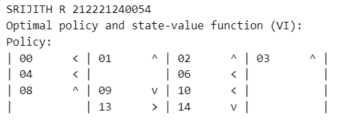
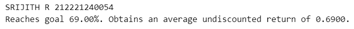
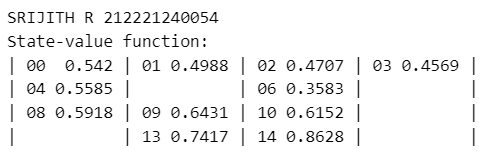

# VALUE ITERATION ALGORITHM

## AIM

To develop a Python program to find the optimal policy for the given MDP using the value iteration algorithm.

## PROBLEM STATEMENT

Design a reinforcement learning algorithm to guide an agent through a grid-based frozen lake environment, where the goal is to reach the destination while navigating through frozen and unfrozen tiles with the risk of falling through the ice. The agent must learn optimal policies to maximize its chances of reaching the goal in a stochastic and slippery environment.

### STATES

The environment has 16 states:

- Two Terminal States: **G**: The goal state & **H**: A hole state.
- 11 Transition states / Non-terminal States including **S**: The starting state.

### The agent can take two actions:

- 0: Move left.
- 1: Move right.
- 2: Move up.
- 3: Move down.

### Transition Probabilities

- **33.33%** chance that the agent moves in the intended direction.
- **66.66%** chance that the agent moves in the orthogonal direction.

### Reward

The agent receives a reward of +1 for reaching the goal state (G). The agent receives a reward of 0 for all other states.

## VALUE ITERATION ALGORITHM

- Value iteration is a method of computing an optimal MDP policy and its value.
- It begins with an initial guess for the value function, and iteratively updates it towards the optimal value function, according to the Bellman optimality equation.
- The algorithm is guaranteed to converge to the optimal value function, and in the process of doing so, also converges to the optimal policy.

The algorithm is as follows:

1. Initialize the value function V(s) arbitrarily for all states s.
2. Repeat until convergence:
   - Initialize aaction-value function Q(s, a) arbitrarily for all states s and actions a.
   - For all the states s and all the action a of every state:
     - Update the action-value function Q(s, a) using the Bellman equation.
     - Take the value function V(s) to be the maximum of Q(s, a) over all actions a.
     - Check if the maximum difference between Old V and new V is less than theta.
     - Where theta is a small positive number that determines the accuracy of estimation.
3. If the maximum difference between Old V and new V is greater than theta, then
   - Update the value function V with the maximum action-value from Q.
   - Go to step 2.
4. The optimal policy can be constructed by taking the argmax of the action-value function Q(s, a) over all actions a.
5. Return the optimal policy and the optimal value function.

## VALUE ITERATION FUNCTION

```py
#SRIJITH R 212221240054
def value_iteration(P, gamma=1.0, theta=1e-10):
    V = np.zeros(len(P), dtype=np.float64)

    while True:
        Q = np.zeros((len(P), len(P[0])), dtype=np.float64)
        for s in range(len(P)):
            for a in range(len(P[s])):
                for prob, next_state, reward, done in P[s][a]:
                    Q[s][a] += prob * (reward + gamma * V[next_state] * (not done))


        if np.max(np.abs(V - np.max(Q, axis=1))) < theta:
            break
        V = np.max(Q, axis=1)

    pi = lambda s: {s: a for s, a in enumerate(np.argmax(Q, axis=1))}[s]

    return V, pi
```

## OUTPUT:





## RESULT:

Thus the python program to implement value iteration to find the optimal policy is completed successfully.
